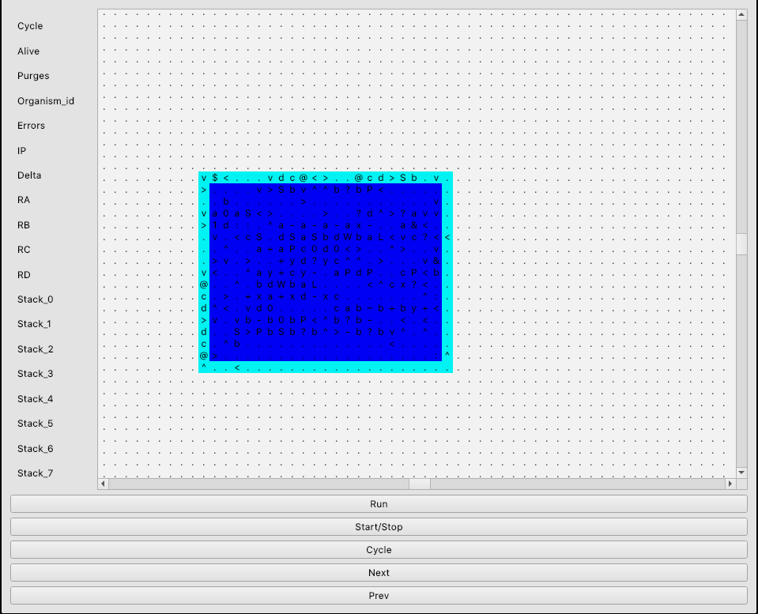

# Fungera
> Truly 3D Artificial Life simulation

This is enhanced C++ version of Fungera with more features and Qt visual front-end

## Features
* Front End written on **Qt**
* Aims to be as fast as possible because speed was main drawback of previous Python implementations ([1] & [2]) of Fungera
* Possibility to make snapshots of the systems, restore from snapshots
* Extraction and analysis of organisms in the environment and alone
* Utility functions that provide statistics
* New organisms and instructions are added
* Parasitism can be observed
* Instruction pointer visualization can be set on and off
* Configured via command line options

## Weak points
* It is still single threaded, performance is not at its peak
* Some bugs are still present

## Usage
#### Dependencies
It requires Qt for front-end and Boost for command line options parsing

---

Program is compiled with `CMake`:
```
mkdir build
cd build
cmake ..
make
```

`qtfungera` executable will be generated.

Configurations and behaviour is controlled via command line options. Run program with `--help` flag to find out how to use it.

For example, to simply run a simulation for a genome, execute

`./qtfungera -f ../gens/initial.gen`

Here **../gens/initial_simple_improved.gen** is file, where initial genome for organism is stored; some basic genomes are added in **gens** directory at the root of this project

Instructions (the symbols in each cell of the organism) are defined as `Organism::_instImpls` in file **organism.cpp**. Also description for some commands can be found in [Paper 1](#reference-papers)



The organism is in blue, light blue indicates borders of organism (useful to visually see different organisms when they are stacked one next to another; they are also part of organism)

Left panel will be filled with values once simulation has begun.

**Tip:** 
To generate large system quickly (for hundreds of thouthands cycles), consider minimizing visual Qt program for some time, because visualization consumes a lot of CPU time (when minimized, visualization does not take time and back-end works faster)


## Documentation
#### Organization
* **main.cpp** contains command line option parser and depending on flags decides what program will do. Under the hood, simulation is busy loop. On each iteration each organism executes a single instruction
* **organism.cpp & organism.h** contains Organism class, which is the basic primitive for evolution. This class contains functions, which are executed when instruction pointer is on a specific location on memory map (see below -- *memory*).
* **organismqueue.cpp & organismqueue.h** contains OrganismQueue class, which is used as singleton class in **main.cpp**. It has functions to kill organisms, iterating through organisms to execute its instructions, add organisms to queue etc.
* **memory.cpp & memory.h** contains class Memory, which is build of cells. Each cell contains an instruction or is empty. Organisms' instruction pointer points to the location on the memory (cell) and organism executes it. (Mutations are implemented by substituting a *random* location on memory map, so that an organism will perform a different action, once its instruction pointer reaches mutated cell)
* **statistics.cpp & statistics.h** contains function for analyzing the system, e.g. calculating entropy, building evolutional tree
* **mainwindow & statuspanel** contains classes and methods required for Qt front-end

ncurses/* branches contains deprecated ncurses version of C++ implementation.


## Reference papers
* [1] Poliakov, Mykhailo. "Evolution of digital organisms in truly two-dimensional memory space", 2020
* [2] Syzonov, Oleksandr. "Investigation of the truly two-dimensional artificial life evolution", 2021
* [3] Yavorskyi, Hermann. "Implementation of the efficient truly two-dimensional artificial life simulation", 2021

## Authors
[Pavlo Yasinovskyi](https://github.com/kenticent-edu)

[Yaroslav Revera](https://github.com/archy-co)

[Maksym Tsapiv](https://github.com/MaksymTsapiv)
